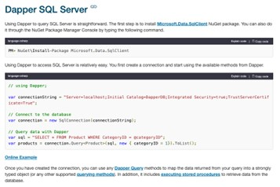

# Plan

The function app is going to be the API for my hiking platform.

- Add CRUD endpoints for users, hikes, and mountains. Then add endpoints to record hikes a user has done and ratings.
- Add blob storage functionality to upload photos for hikes.
- Have unit tests, then add integration tests.
- Get Azurite and a database running in Docker.
- Create a C# solution with a Function App project. See [Azure Functions in VS Code](https://learn.microsoft.com/en-us/azure/azure-functions/how-to-create-function-vs-code?pivot=programming-language-csharp) for more information (don’t worry about deploying the app to Azure).
- Define a **Mountain** model with the following required properties:
  - `Id`
  - `Name`
  - `Height`
  - `Location`
- Create a `mountains.json` file with an array of at least 5 mountain objects.
- Create a static class with a static method that reads the `mountains.json` file and returns a list of mountains.
- Create a mountain service class that calls the static class to return the mountains as a list.
- Define a mountains function (HTTP) endpoint that calls the mountain service to return the list of mountains.
- Add an xUnit test project to the solution and write unit tests for the code written.
- Add a README that documents how to run the project and the unit tests.
- Use Postman to query your mountains endpoint (Controller-Service-Repository pattern).
- Add dependency injection to register and resolve mountain services. See [Azure Functions Dependency Injection](https://learn.microsoft.com/en-us/azure/azure-functions/functions-dotnet-dependency-injection).
- Add a database next (Azure SQL):
  - [Get Started with SQL Database Projects](https://learn.microsoft.com/en-us/sql/ssdt/sql-server-data-tools)
  - Use SSMS to write SQL queries and create a `mountains` table to match the object.
  - [Install SQL Server Management Studio](https://learn.microsoft.com/en-us/sql/ssms/download-sql-server-management-studio-ssms)
  - [Lesson 1: Connecting to the Database Engine](https://learn.microsoft.com/en-us/sql/ssms/tutorials/connect-to-the-database-engine)
- Implement Dapper to communicate with the database. Then inject the database service into the mountain service to read and write to the database. See [Dapper Database Providers](https://dapper-tutorial.net/).
  - Inject an `IOptions` provider into the database service to retrieve the connection string from app settings.

---

## Notes

### Dependency Injection (DI)
DI is a design pattern where an object receives its dependencies from an external source rather than creating them itself.

- Instead of a class saying “I’ll build my own Email Service,” DI lets the class say “I need something that can send emails,” and the system provides it.
- This approach decouples classes from concrete implementations, making code more modular, testable, and maintainable.

**Why use DI?**
- Loose Coupling: Classes depend on abstractions (interfaces), not concrete implementations.
- Flexibility: Swap implementations without changing the consuming class.
- Testability: Easily inject mocks or stubs for unit tests.
- Maintainability: Changes in dependencies don’t ripple through the codebase.
- Supports SOLID principles, especially the Dependency Inversion Principle.

**Common types:**
1. Constructor Injection – Pass dependencies via the constructor (most common and recommended).
2. Setter Injection – Use public setters to inject dependencies.
3. Interface Injection – The dependency provides a method to inject itself into the client.

---

### SSMS (SQL Server Management Studio)
SSMS is a GUI tool for connecting to SQL Server or Azure SQL Database. It lets you:
- Connect to the database using your connection string.
- Write and execute SQL queries directly (e.g., `CREATE TABLE`, `INSERT`, `SELECT`).
- Inspect tables, run queries, and manage schema without deploying from VS Code.

---

### SOLID Principles
1. **S – Single Responsibility Principle (SRP)**  
   A class should have only one reason to change, meaning it should focus on a single responsibility or purpose.  
   *Example:* A class that handles user authentication should not also manage database operations.

2. **O – Open/Closed Principle (OCP)**  
   Software entities should be open for extension but closed for modification.  
   *Example:* Use inheritance or interfaces to add new behaviors without changing the original class.

3. **L – Liskov Substitution Principle (LSP)**  
   Objects of a superclass should be replaceable with objects of its subclasses without breaking the application.

4. **I – Interface Segregation Principle (ISP)**  
   Clients should not be forced to depend on interfaces they do not use.  
   *Example:* Separate interfaces for reading and writing operations instead of one big interface.

5. **D – Dependency Inversion Principle (DIP)**  
   High-level modules should not depend on low-level modules; both should depend on abstractions.  
   *Example:* Use dependency injection.

